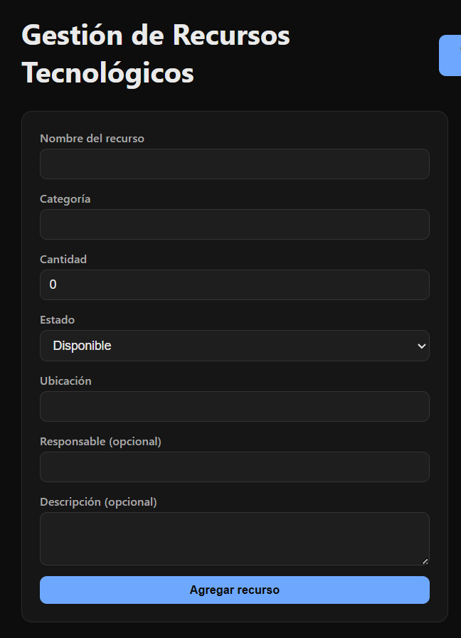
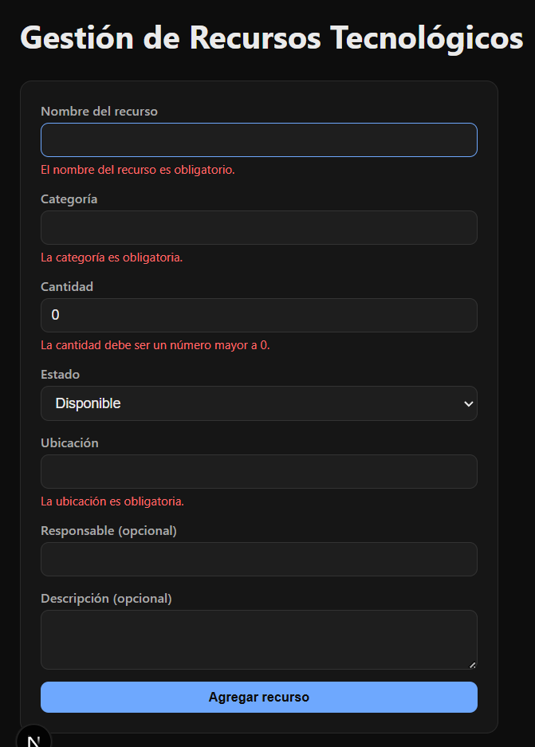
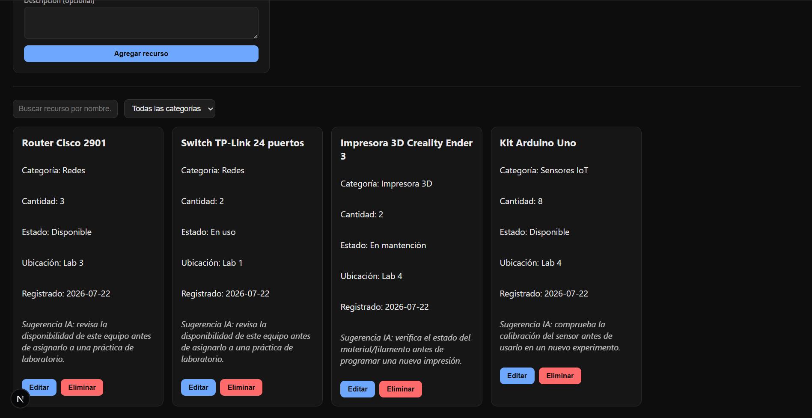
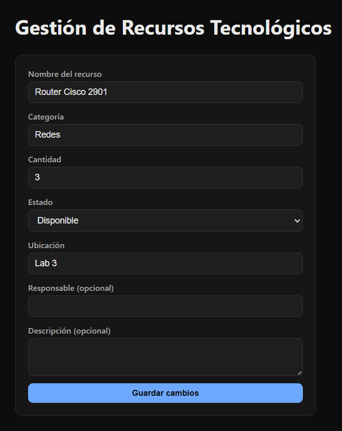
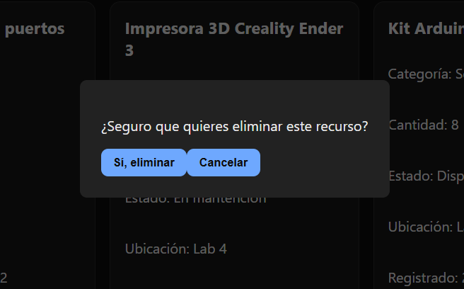
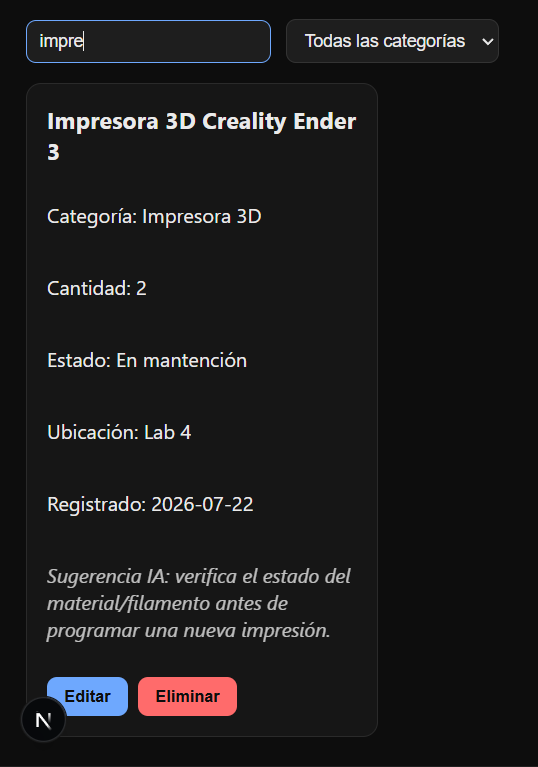
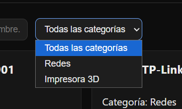
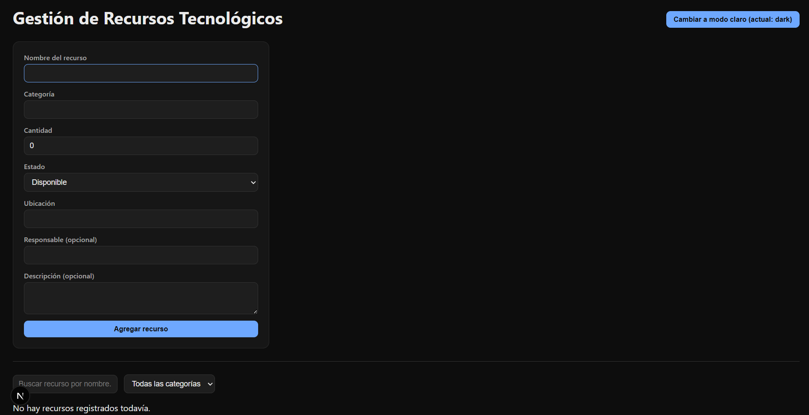
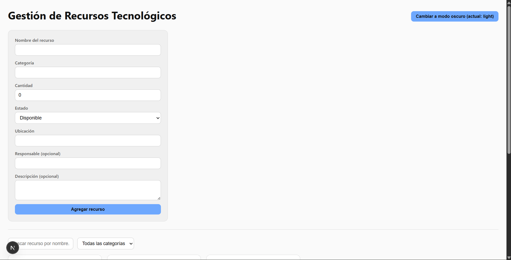

# Sistema de Gestión de Recursos Tecnológicos

## Nombre Estudiante
Danitza Isla Ojeda

## Descripción del proyecto
Aplicación SPA desarrollada con React y Next.js para administrar los recursos tecnológicos de un laboratorio (notebooks, routers, switches, impresoras 3D, sensores IoT, entre otros). Permite registrar, listar, editar, eliminar, buscar y filtrar recursos, utilizando distintos mecanismos de almacenamiento del navegador según el tipo de dato.

## Tecnologías utilizadas
- Next.js (App Router)
- React
- TypeScript
- Local Storage
- Session Storage
- Cookies (vía librería `js-cookie`)

## Instalación y ejecución
```bash
git clone https://github.com/nanii06/ev4-front-end.git
cd ev4-front-end
npm install
npm run dev
```
Luego abrir `http://localhost:3000` en el navegador.

## Funcionalidades
- Crear recurso
- Listar recursos
- Editar recurso
- Eliminar recurso (con confirmación)
- Buscar por nombre
- Filtrar por categoría
- Guardar datos principales en Local Storage
- Guardar filtros/búsqueda temporal en Session Storage
- Guardar preferencia de tema (claro/oscuro) en Cookies
- Sugerencia IA simulada según categoría del recurso

## Componentes principales
- **Header**: título de la app y control de cambio de tema.
- **ResourceForm**: formulario de creación y edición de recursos (reutilizado para ambos casos).
- **ResourceList**: renderiza la lista de recursos filtrados.
- **ResourceCard**: representa un recurso individual, con sus acciones de editar/eliminar y la sugerencia IA.
- **SearchBar**: input de búsqueda por nombre.
- **FilterCategory**: selector de filtro por categoría.
- **ConfirmDeleteModal**: modal de confirmación antes de eliminar un recurso.

## Hooks utilizados
- `useState`: manejo de estado de formularios, filtros y modales.
- `useEffect`: sincronización de los hooks de storage con el navegador.
- `useMemo`: cálculo optimizado de categorías disponibles y lista filtrada.
- **useLocalStorage** (personalizado): persiste la lista de recursos en Local Storage.
- **useSessionStorage** (personalizado): persiste el término de búsqueda y la categoría seleccionada en Session Storage.
- **useCookie** (personalizado): persiste la preferencia de tema (claro/oscuro) en una cookie.

## Uso de almacenamiento del navegador
- **Local Storage** (clave `lab_resources`): almacena la lista completa de recursos tecnológicos, persistente entre sesiones.
- **Session Storage** (claves `lab_resource_filter_search` y `lab_resource_filter_category`): almacena el filtro de búsqueda y categoría seleccionada, se pierde al cerrar la pestaña.
- **Cookies** (clave `lab_theme`): almacena la preferencia de tema visual del usuario, con expiración de 30 días.

## Uso de inteligencia artificial
Se utilizó Claude (Anthropic) como apoyo durante el desarrollo, principalmente para:
- Definir la estructura inicial de carpetas y componentes.
- Diseñar los hooks personalizados (`useLocalStorage`, `useSessionStorage`, `useCookie`) y su manejo correcto de hidratación en Next.js.
- Corregir errores durante el desarrollo (error de hidratación SSR, formulario de edición que no actualizaba sus valores).
- Sugerir validaciones de formulario.
- Diseñar la función simulada "Sugerencia IA" según categoría del recurso.


## Conclusión
El desarrollo de esta aplicación permitió aplicar de forma práctica los tres mecanismos de almacenamiento del navegador (Local Storage, Session Storage y Cookies), comprendiendo las diferencias de persistencia entre cada uno, además de reforzar el uso de hooks personalizados y componentes reutilizables en un proyecto real con Next.js y TypeScript.

## Capturas de pantalla

### Formulario de creación


### Validación de formulario


### Listado de recursos


### Edición de recurso


### Confirmación de eliminación


### Búsqueda por nombre


### Filtro por categoría


### Tema oscuro y claro

